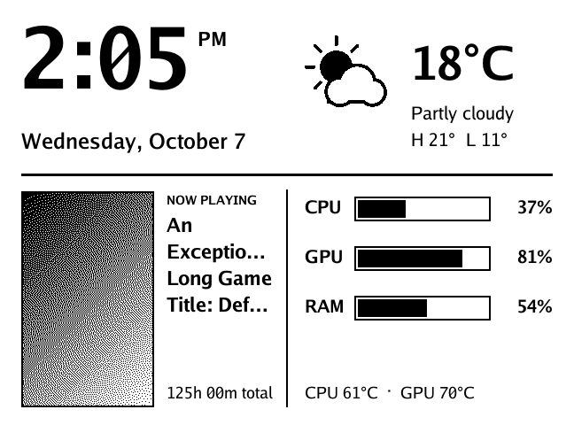
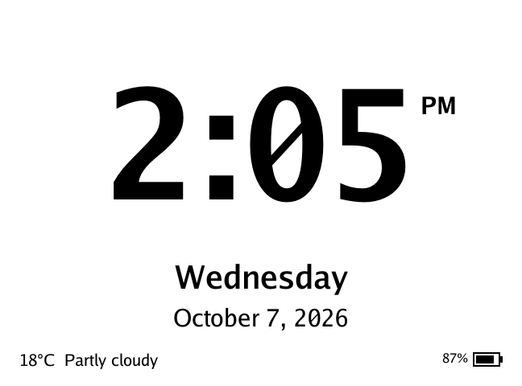

# monoink

**An open-source, privacy-first Decky plugin for the JSAUX E-Ink faceplate
on SteamOS.** Show the time, weather, what you're playing, system stats and
your own photos on the 5.83" e-paper display, configured entirely from
Gaming Mode. No terminal, no sudo, no tracking.

<p align="center">
  
  
  <br>
  
  
</p>

> **Status: v0.1, first public release.** Tested on a Steam Machine running a
> SteamOS preview build. It should work on any SteamOS device with Decky
> Loader (including Steam Deck), but those aren't tested yet. Reports welcome.
>
> monoink is an independent community project. It is not affiliated with or
> endorsed by JSAUX.

## Install

You need [Decky Loader](https://decky.xyz) and the faceplate switched on.
You don't need to pair the faceplate in Steam's Bluetooth settings.

1. Download **`monoink-vX.Y.Z.zip`** from the
   [latest release](https://github.com/v1k0d3n/monoink/releases/latest)
   (under **Assets**).
2. In Gaming Mode, press **⋯** → **Decky** (plug icon) → **⚙ Settings** and
   turn on **Developer mode**.
3. Open Decky's new **Developer** tab → **Install Plugin From ZIP File** →
   choose the zip.
4. Open **E-Ink Faceplate** in the Decky menu. It finds your display by
   itself, and within a few seconds the faceplate shows the dashboard.

To update, install the newer zip the same way (your settings are kept). If
you used JSAUX's own installer before, run their uninstaller first. More
detail and troubleshooting: **[docs/install.md](docs/install.md)**.

## What it does

- **Screens:** clock, calendar, weather, performance (CPU/GPU/RAM and
  temperatures), the game you're playing or last played with its cover art,
  a photo frame, and a combined dashboard.
- **Rotate or pin** screens, and switch to the game automatically while
  you play.
- **Custom cards:** your own scripts can put status information on the
  display (build status, smart-home sensors, anything) once you approve
  them. See **[docs/providers.md](docs/providers.md)**.
- **Reliable connection:** finds the faceplate in about a second,
  reconnects on its own whenever the connection drops, and remembers your
  display so a neighbour's is never picked up.

## Why this project exists

We bought the faceplate and found the official software didn't work on a
current SteamOS build. When we looked at why, we found design choices we
weren't comfortable with. **We couldn't find a public source repository for
the official software**; it ships as an installer containing Python code,
which is what we reviewed. Rather than patch it, we wrote monoink from
scratch with different goals:

- **It should just work**, from Gaming Mode, for people who never open a
  terminal.
- **It should be impossible to break with a SteamOS update.**
- **It should never touch anything it doesn't need**, and tell you exactly
  what it does use.
- **It should be open**, so anyone can check those claims.

No JSAUX code is included. monoink speaks the same Bluetooth protocol, which
we learned from their package (see [NOTICE](NOTICE)).

## How it compares

Compared with the official **JSAUX E-INK V1.1** package (installer revision
*OneClick-r3*, September 2026), which is the version we examined:

| | JSAUX E-INK V1.1 | monoink |
| --- | --- | --- |
| **Source code** | No public repository found; Python files inside an installer | Open source (MIT) on GitHub, with tests and public CI builds |
| **Installation** | Unzip in Desktop Mode, run a `.desktop` installer, approve an admin prompt | Install a zip from Decky in Gaming Mode |
| **Admin rights** | Uses `sudo`. If your account has no password, the installer **sets a temporary random password on it** to get sudo, then removes it | Never uses sudo or asks for a password |
| **System changes** | Adds a udev rule in `/etc` for raw touchscreen access, a background service in your user's systemd folder, desktop shortcuts and icons | None outside Decky's own plugin and settings folders |
| **Uninstalling** | In our case left the background service enabled and restarting every two seconds, plus the `/etc` rule and backup folders | Uninstall in Decky; only the settings folder remains |
| **Works on current SteamOS** | No: its bundled Python libraries are built only for Python 3.11/3.13, and current SteamOS ships 3.14, so the background service fails to start and the plugin shows "off" | Yes: one self-contained program with no Python libraries or system dependencies |
| **Bluetooth reliability** | A failed connection isn't retried until you toggle it again; a saved display that isn't found isn't searched for | Never gives up while enabled: retries automatically with backoff and explains what's wrong in plain language |
| **Update speed** | Reconnects for every frame | Keeps the connection open; about 3 seconds per update |
| **AI-assistant data** | Reads your **Codex/ChatGPT login file** (`~/.codex/auth.json`), refreshes the login tokens and **writes them back into that file**, fetches the titles of your **20 most recent ChatGPT conversations**, and scans your Codex session logs. This runs whenever the plugin's panel polls for status, whether or not you use that feature, and nothing asks for consent | Never reads other apps' files or accounts. Integrations are separate programs you choose to run, and nothing is shown until you approve them |
| **Your location** | Looks up your location from your IP address (`ipwho.is`) automatically, for the calendar and weather | Nothing is looked up until you type a city for weather |
| **Local network interface** | A web API on `127.0.0.1:39062` with no authentication or origin checks; it broadcasts status (including the AI-assistant data above) to any connected client, and can list image files in any folder | Private sockets readable only by your user account; no network port is opened |
| **Temporary files** | Lock files in `/tmp` created world-writable (`0666`) | None in shared locations |

We reported what we found in their package as it was when we examined it;
later JSAUX releases may differ.

## Privacy and security

These are rules the code follows, and that every contribution must keep:

- **No sudo, no system changes.** monoink runs as your normal user and only
  writes to its own settings and cache folders.
- **Nothing about you leaves the device unless you turn it on.** Each
  network request below is listed with what triggers it.
- **No access to other apps' data.** monoink never reads other programs'
  files, passwords or accounts.
- **Approval for integrations.** Programs that send cards are held until you
  approve them, and you can revoke them at any time.

Everything monoink reads or contacts:

| Source | When |
| --- | --- |
| BlueZ (the system Bluetooth service) | always: finding and talking to the display |
| `/proc`, `/sys` | performance screen: CPU, memory, temperatures, GPU load |
| Steam's local files (`steamapps/*.acf`, `userdata/*/config/localconfig.vdf`, `appcache/librarycache`) | game screen: name, playtime, cached cover art |
| The photo folder you choose | photo frame |
| `api.open-meteo.com`, `geocoding-api.open-meteo.com` | only after you set a weather location |
| `cdn.akamai.steamstatic.com` | only if you enable "Download missing cover art" |

## Documentation

- [Installing](docs/install.md): step-by-step install, update and troubleshooting.
- [Custom cards](docs/providers.md): show your own information on the display.
- [Development](docs/development.md): building, testing, CI and releases.

## For developers

Only `podman` (preinstalled on SteamOS) or `docker` is needed; the whole
toolchain is defined in [`Containerfile`](Containerfile).

```bash
./package.sh          # test and build → out/monoink.zip
```

The plugin's background program, `monoinkd`, also works from a terminal:

```bash
monoinkd probe -test-pattern     # find the display, show its info, draw a test pattern
monoinkd send picture.jpg        # dither and display an image
monoinkd push -id my-tool -title "Build" -line "main: passing"   # send a card
```

## License

MIT. See [LICENSE](LICENSE) and [NOTICE](NOTICE).
