# Screens

Every screen monoink can show, in the normal and dark-mode styles. These
images are rendered from the code with fictional sample data, exactly as the
1-bit panel shows them, and are regenerated with each change that affects a
screen (`./package.sh previews`).

## Dashboard

Time and date, weather, the current or last game, and system load at a glance. Updates every minute.

| Light | Dark mode |
| --- | --- |
| 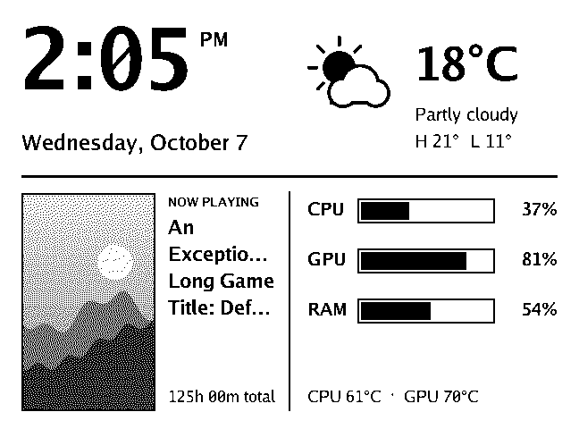 | 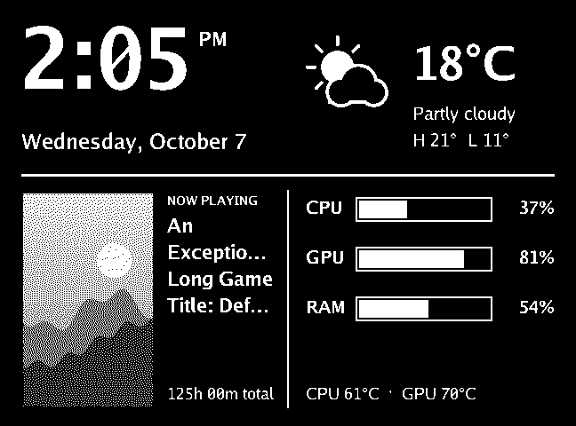 |

## Clock

A large clock with the date and, optionally, year progress (day and week of the year). Updates every minute.

| Light | Dark mode |
| --- | --- |
| 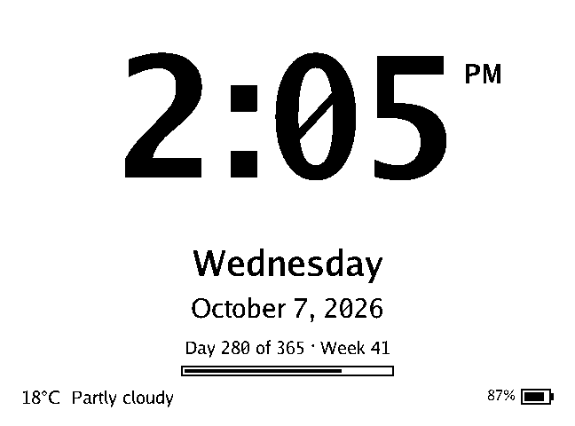 | 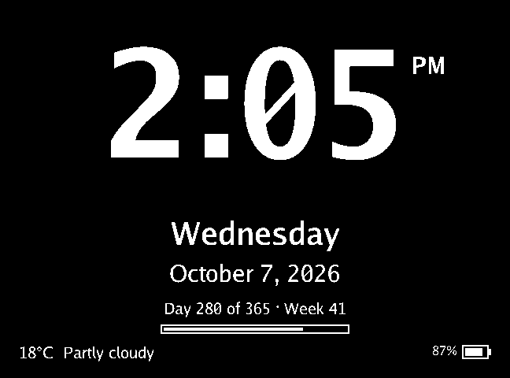 |

## Weather

Current conditions and a 5-day forecast from Open-Meteo, for the location you choose.

| Light | Dark mode |
| --- | --- |
| 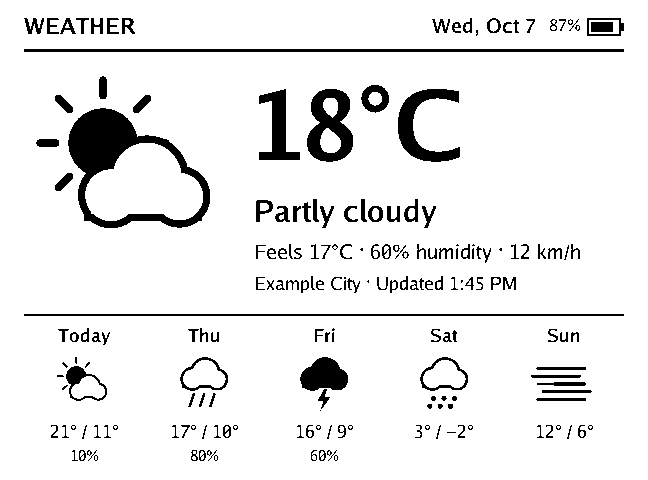 | 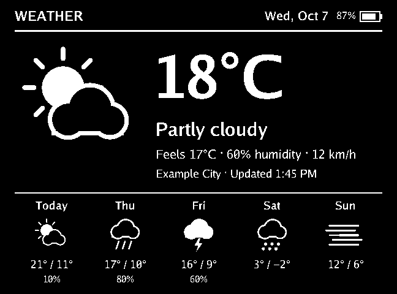 |

## Game

The game you're playing (or last played) with its cover art and playtime.

| Light | Dark mode |
| --- | --- |
| 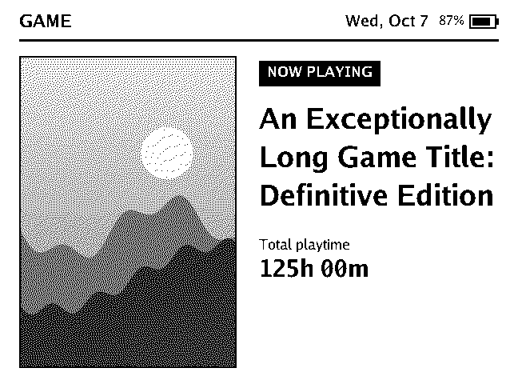 | 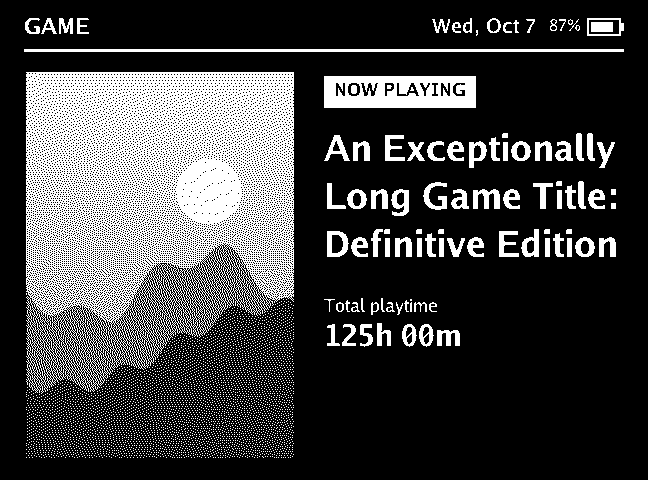 |

## Performance

CPU, GPU and memory load with temperatures, plus a 30-minute history graph. Updates every minute.

| Light | Dark mode |
| --- | --- |
| 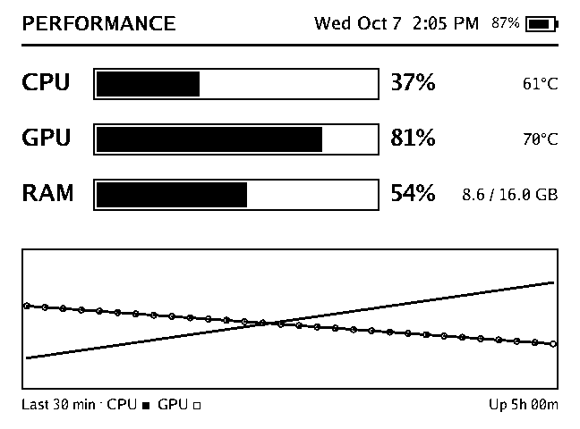 | 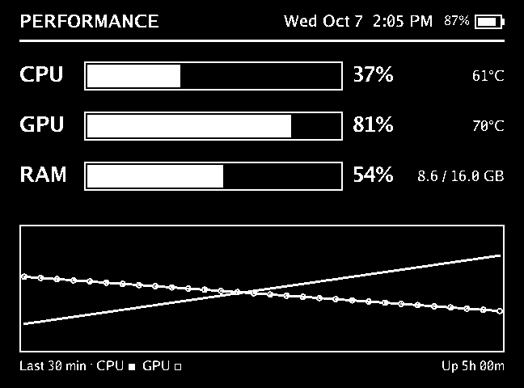 |

## Calendar

This month, with today highlighted.

| Light | Dark mode |
| --- | --- |
| 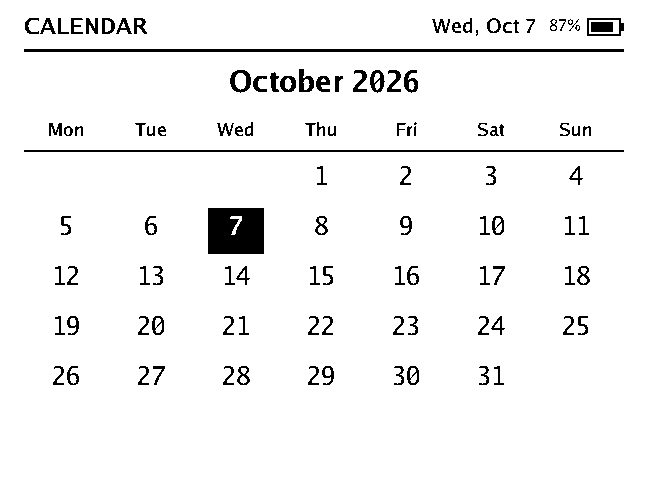 | 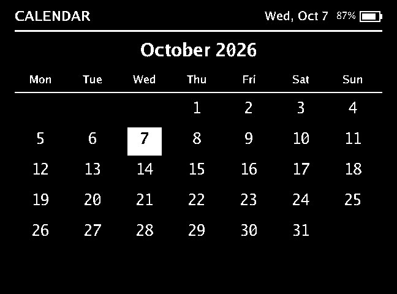 |

## Photo frame

Pictures from a folder you choose, dithered for the e-ink panel.

| Light | Dark mode |
| --- | --- |
| 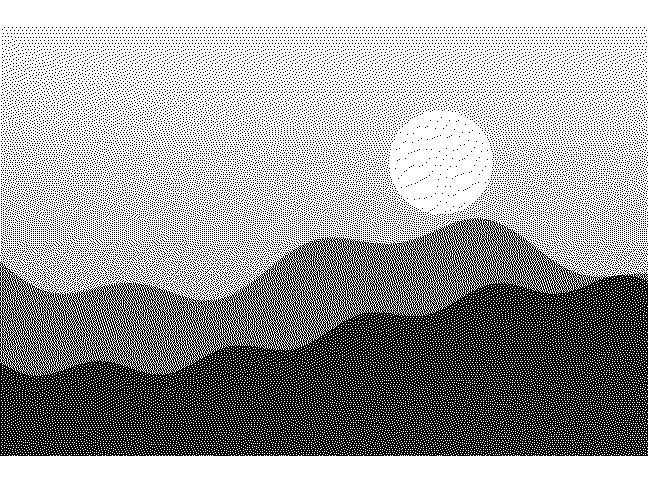 |  |

## Provider card

A status card sent by a program you've approved. See [Custom cards](providers.md).

| Light | Dark mode |
| --- | --- |
| 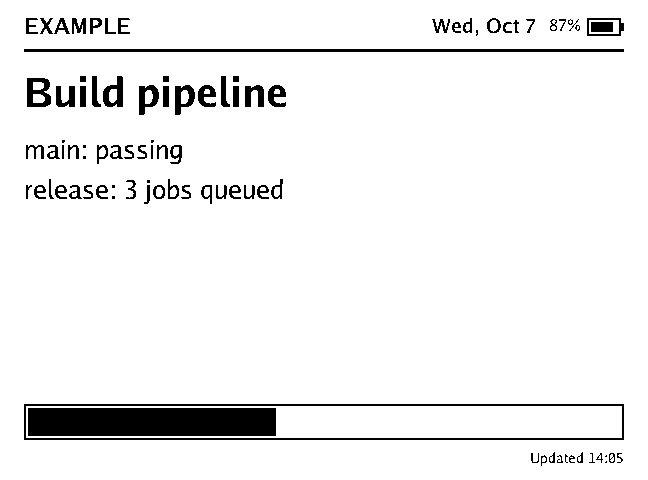 | 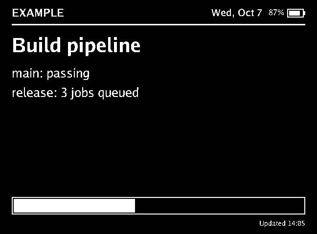 |
